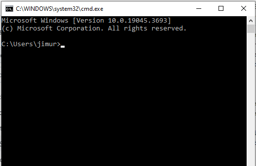
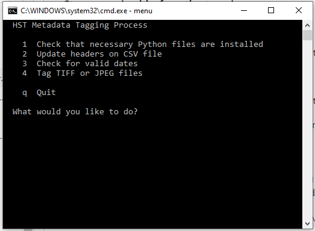
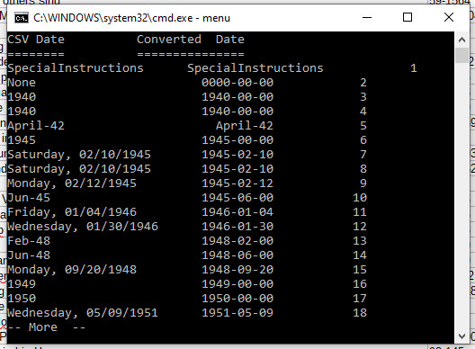
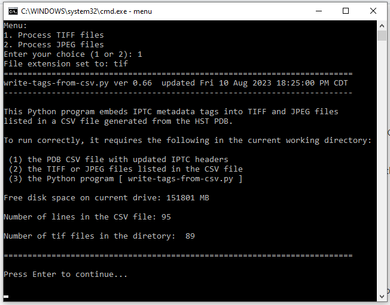
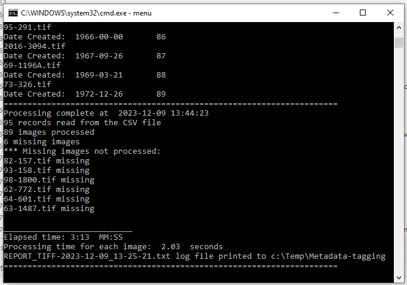

## Truman Library PDB Metadata Tagging Process

<p align="justify"> last update: 2023-12-11 1830 </p>

The following describes the steps to apply metadata tags to photos from the Truman Library Photo Database (PDB).

### Steps required before the tagging process can begin

Before the tagging process can begin, the following steps must be completed:

<p> - a CSV file must be generated from the PDB that contains the metadata to be embedded in the TIFF and JPEG images to be processed </p>
<p> - JPEG images must be generated from the TIFF images </p>
<p> - JPEG images must be resized to 800 pixels max on either the X or Y axis.</p>
<p> - Copyright watermarks must be added to restricted JPEG images </p>

### Tagging process

The directory <b>'C:\Temp\Metadata-tagging'</b> on the Scanning Workstation has been set aside as the <b><i>working directory</i></b> where work associated with the metadata tagging process is performed.

1. Begin by copying the following required files to the <b>```C:\Temp\Metadata-tagging```</b> directory:
    - CSV metadata file generated from the PDB
    - all the photos listed in the CSV metadata file
    
2. Open a Command Window by pressing the Windows Key + R, then type <b>```cmd```</b>.  The following should appear

     

     - Change to the Current Working Directory by entering: 

     <b>``` cd c:\Temp\Metadata-tagging <cr>``` </b>    [ changes to the working directory ]

     - Next, enter:

     <b>```menu <cr>```</b>

    
 
     - from this menu, all activities associated with metadata tagging can be performed
  
3. Check that all necessary Python files are installed

     - select <b>```1 <cr>``` </b>

     The message: ``` All files exist in the current directory. You are good to proceed to the next step.```  speaks for itself.

     If a message like this appears:

     ```The following file(s) do not exist in the current directory:```
         
      this is not good!!!! better call Jim :-) . . . [it's his fault]

      ... or you can try downloading ```install-files.py``` from the HST GitHub repository and run the command ```python install-files.py ``` in the current working directory

4.  Update headers on CSV file

     - select <b>```2 <cr>``` </b>
  
    This step creates a file ``` export.csv ``` with the header names the tagging process is expecting

5. Check for valid dates

     - select <b>```3 <cr>```</b> checks for valid dates
    
     

     Press the ```space bar``` to page through the output.  You are looking for any date in the Converted Date column that does not follow the YYYY-MM-DD format.

   In the above case, line 5 has an invalid date.  You can use MS Excel to edit the date in the <b>export.csv</b> file.  
   
6. Tag TIFF images

    - select <b>```4 <cr>```</b> Tag TIFF and JPEG files
    
     

    Note: ```Number of lines in the CSV file``` should equal  ```Number of tif files in the directory```

   Once you press ```Enter``` and start the processing, each image takes 1-2 seconds.

   When the processing is complete the following appears and a report is printed to the current working directory.

  
   
7. Tag JPEG images

    - select <b>```4 <cr>```</b> Tag TIFF and JPEG files
          
    - this should work exactly like the TIFF processing except you select JPEG on the opening menu

 8. Post-processing spot checks

    <p> Post-processing review of TIFF and JPEG images can be easily accomplished using <b>nomacs</b>, an image viewer that allows metadata to be displayed next to the image.  To configure nomacs, select Panel from the top menu and then File Explorer and Metadata Info.  This will create 3-panel view that allows you to move through TIFF and JPEG images.</p>
     
    <p>Things to spot-check in processed TIFF and JPEG images:</p>

    - JPEG images have a max 800 pixels on either the X or Y axis
    - copyright watermarks have been added to appropriate JPEG images
    - metadata tags have been applied to both JPEG and TIFF images
      
11. Post-processing file handling

    - move/save tagged TIFF and JPEG images to a 'shared drive' to clear space for the next batch of images to be processed.
    - move/save the REPORT files to an appropriate directory
    - move/save the PDB CSV file 
