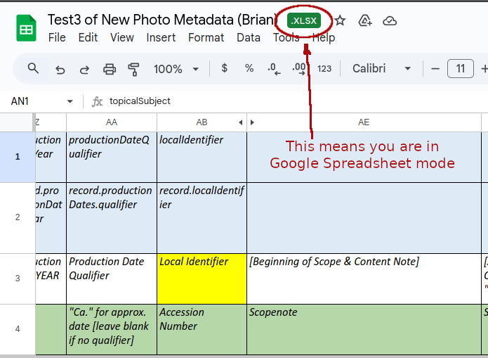
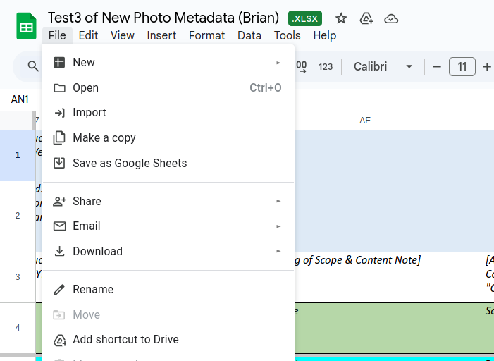
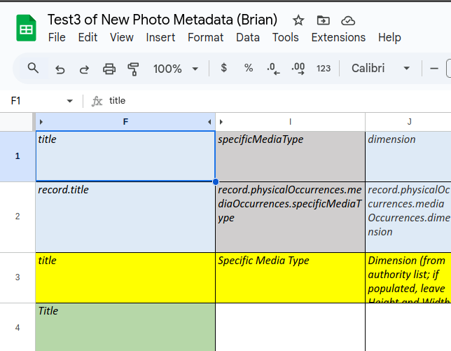

# Google Spreadsheet to Google Sheet Conversion Guide

## Overview

This document outlines the process of converting a Google Spreadsheet into a Google Sheet that can be programmatically accessed and manipulated. Understanding the subtle differences between these two formats is crucial for automation and API integration workflows.

## Table of Contents

1. [Introduction](#introduction)
2. [Key Differences](#key-differences)
3. [Visual Documentation](#visual-documentation)
4. [Conversion Process](#conversion-process)
5. [Programmatic Access](#programmatic-access)
6. [Best Practices](#best-practices)
7. [Troubleshooting](#troubleshooting)

## Introduction

Google Spreadsheets and Google Sheets, while often used interchangeably, have important distinctions when it comes to programmatic access. This guide documents the conversion process and highlights the key differences that affect API integration and automated workflows.

## Key Differences

### Google Spreadsheet vs Google Sheet

- **Google Spreadsheet**: [Brief description of what constitutes a Google Spreadsheet]
- **Google Sheet**: [Brief description of what constitutes a Google Sheet]
- **API Access**: [Differences in how APIs can interact with each format]
- **Programmatic Control**: [Differences in automation capabilities]

## Visual Documentation

The following screenshots demonstrate the conversion process and highlight the key interface differences:

### Page 1: Knowing when you are in the Google Spreadsheet State


*Caption: Description of what is shown in Page-1.png - initial spreadsheet configuration or interface elements*

### Page 2: Save as Google Sheets


*Caption: Description of what is shown in Page-2.png - intermediate steps or conversion interface*

### Page 3: How to know you are in the Google Sheet State


*Caption: Description of what is shown in Page-3.png - final Google Sheet state or resulting interface*

## Conversion Process

### Step-by-Step Instructions

1. **Preparation**
   - [Describe initial setup requirements]
   - [Any prerequisites or permissions needed]

2. **Conversion Steps**
   - [Detailed step-by-step conversion process]
   - [Include any menu options, buttons, or interface elements to click]

3. **Verification**
   - [How to verify the conversion was successful]
   - [What changes to look for in the interface]

## Programmatic Access

### API Differences

- **Before Conversion**: [Describe API limitations with Spreadsheet format]
- **After Conversion**: [Describe enhanced API capabilities with Sheet format]

### Code Examples

```python
# Example code for accessing Google Sheets API
# (To be filled in with specific implementation details)
```

### Authentication Requirements

- [Required credentials and setup]
- [Service account vs OAuth considerations]

## Best Practices

### When to Convert

- [Scenarios where conversion is beneficial]
- [Use cases for programmatic access]

### Considerations

- [Important factors to consider before conversion]
- [Potential impacts on existing workflows]

## Troubleshooting

### Common Issues

- [List of common problems during conversion]
- [Solutions and workarounds]

### Error Messages

- [Common error messages and their meanings]
- [Resolution steps]

## Additional Resources

- [Google Sheets API Documentation](https://developers.google.com/sheets/api)
- [Google Drive API Documentation](https://developers.google.com/drive/api)
- [Authentication and Authorization](https://developers.google.com/sheets/api/guides/authorizing)

---

*Document Version: 1.0*  
*Last Updated: 2025-06-21*  
*Author: [To be filled]*

## Notes

This document serves as a template for documenting the Google Spreadsheet to Google Sheet conversion process. The content should be updated based on the specific details shown in the accompanying screenshots (Page-1.png, Page-2.png, and Page-3.png) and the actual conversion procedure discovered through testing.

