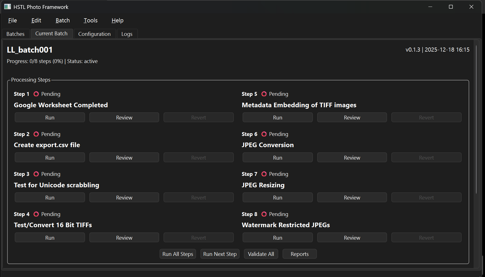

# HSTL Photo Framework - User Guide

## 1. Introduction

Welcome to the HSTL Photo Framework!

This application is designed to streamline the process of preparing digital photo collections for use in the HSTL online digital collections. It guides you through an 8-step pipeline that handles everything from metadata processing to image conversion and watermarking.

The core workflow involves creating a "batch" for a specific photo collection and running it through the eight steps. The application tracks the progress of each batch and ensures that all files are processed correctly and placed in the appropriate directories.

## 2. Initial Setup & Configuration

Before you can process a batch, there are a few one-time setup steps.

### 2.1. ExifTool Installation

ExifTool is required for embedding metadata into image files (Step 5).

1. **Download ExifTool:** Get the Windows executable from https://exiftool.org/
2. **Install:** Extract to a folder in your PATH, or to `%LOCALAPPDATA%\exiftool\`
3. **Verify:** The application will display ExifTool version in **Help → About** if detected correctly

### 2.2. Application Settings

You can access application-wide settings by clicking **Tools → Settings**. Here you can configure default paths and other preferences.

## 3. The Main Application Window

The main window is organized into several key areas:



1. **Menu Bar:** Access main functions like creating new batches (`File`), managing the current batch (`Batch`), accessing tools (`Tools`), and getting help (`Help`).
2. **Batches Tab:** This is the default view. It lists all known photo batches, their status, and progress. You can open, manage, and see a summary of all your projects here.
3. **Current Batch Tab:** After opening a batch, this tab becomes active. It shows the 8 processing steps for the selected batch and allows you to run them.
4. **Configuration Tab:** Displays the complete configuration for the currently opened batch in a read-only view.
5. **Log Viewer:** Shows real-time log messages as the application performs tasks. Check here for detailed information and error messages.

## 4. Step-by-Step Workflow

Processing a photo collection involves creating a batch and running it through the 8 steps in sequence.

### 4.1. Creating a New Batch

1. Click **File → New Batch** (or press `Ctrl+N`).
2. Enter a descriptive name for your batch (e.g., "Truman Home Photos - Jan 2025").
3. Choose where to store the batch data. The default (`C:\Data\HSTL_Batches\\ ) is recommended.
4. Click **OK**.

A new directory structure will be created at the location you specified (`C:\Data\HSTL_Batches\[BatchName]`), and the batch will appear in the "Batches" list.

```
[BatchName]/
├── input/
│   ├── tiff/              ← Place your source TIFF images here
│   └── spreadsheet/       ← Place downloaded Excel file here
├── output/
│   ├── csv/               → Exported CSV (Step 2)
│   ├── tiff_processed/    → Processed TIFFs (Step 4)
│   ├── jpeg/              → JPEG conversions (Step 6)
│   ├── jpeg_resized/      → Resized JPEGs (Step 7)
│   └── jpeg_watermarked/  → Watermarked JPEGs (Step 8)
├── reports/               → Validation and processing reports
├── logs/                  → Processing logs
└── config/
    └── project_config.yaml → Project configuration
```

### 4.2. Preparing Inputs

An Excel Spreadsheet and the corresponding collection of TIFF images are the two inputs the system needs:

- **Excel Spreadsheet:** Selected in Step 1. HPM copies the selected file to the `input/spreadsheet/` directory.
- **TIFF Images:** Selected in Step 4. HPM copies all images from the selected directory to `input/tiff/`.

### 4.3. The 8 Processing Steps

Open a batch by double-clicking it in the "Batches" list. This will take you to the "Current Batch" tab where you can run the steps of the workflow. You can run steps one-by-one, or use "Run All Steps" to execute the entire pipeline.

---

#### **Step 1: Prepare Google Spreadsheet**

* **Purpose:** Ensures the collaborative Google Spreadsheet is correctly formatted and all required metadata fields (Title, Description, Date, etc.) are completed.
* **Action:** This step is a manual check. Ensure your Google Sheet contains all required columns and data before proceeding. When ready, download the Google Sheet as an Excel file (.xlsx) and place it in the batch's `input\spreadsheet\` folder.

---

#### **Step 2: Convert Excel Spreadsheet to CSV**

* **Purpose:** Converts the downloaded Excel spreadsheet (.xlsx) into a local CSV file, which is used by subsequent steps.
* **Action:** Click the "Run" button for Step 2. The application reads the Excel file from `input\spreadsheet\` and exports it as CSV.
* **Output:** A CSV file is created in the `output\csv\` directory.
* **Validation:** The number of rows in the CSV should match the number of Accession Numbers in your spreadsheet.

---

#### **Step 3: Unicode Filtering**

* **Purpose:** Scans the CSV file for problematic non-standard characters (like special quotes or symbols) and identifies them for the archivist to correct them at this point in time.
* **Action:** Click "Run". The process is automatic.
* **Output:** A "clean" version of the CSV may be created, and a report is generated in the `reports\` folder highlighting any changes or issues. 

---

#### **Step 4: Convert 16-bit TIFFs to 8-bit**

* **Purpose:** Converts any 16-bit TIFF images in the `input\tiff\` folder to the standard 8-bit format required for the rest of the pipeline. 8-bit files are copied unchanged.
* **Action:** Click "Run". The process is automatic.
* **Output:** Processed TIFF files are placed in the `output\tiff_processed\` directory.
* **Validation:** The application checks the bit depth of the output files.

---

#### **Step 5: Embed Metadata into TIFFs**

* **Purpose:** Reads the metadata from the CSV file (from Step 2/3) and embeds it directly into the corresponding TIFF files in the `output\tiff_processed\` folder.
* **Action:** Click "Run". The application matches image filenames to records in the CSV.
* **Output:** The TIFF files in `output\tiff_processed\` are now updated with metadata. A report is generated in the `reports\` folder.
* **Validation:** You can spot-check the metadata using a tool like `nomacs` or by viewing file properties in Windows Explorer.

---

#### **Step 6: Convert TIFF to JPEG**

* **Purpose:** Converts the processed, metadata-rich TIFF files into high-quality JPEG images.
* **Action:** Click "Run".
* **Output:** JPEG files are created in the `output\jpeg\` directory.
* **Validation:** The number of JPEGs created should match the number of TIFFs processed.

---

#### **Step 7: Resize JPEGs**

* **Purpose:** Creates smaller, web-friendly versions of the JPEGs, resized to fit within an 800x800 pixel box.
* **Action:** Click "Run".
* **Output:** Resized JPEGs are placed in the `output\jpeg_resized\` directory.
* **Validation:** You can spot-check the dimensions of the output images.

---

#### **Step 8: Add Watermarks**

* **Purpose:** Adds the HSTL copyright watermark to the resized JPEGs for images that are marked as "restricted."
* **Action:** Click "Run". The tool checks the metadata of each image to see if a watermark is required.
* **Output:** Watermarked JPEGs are created in the `output\jpeg_watermarked\` folder. Non-restricted images are copied without a watermark.
* **Validation:** You can spot-check the output images to ensure the watermark was applied correctly.

---

## 5. Troubleshooting

* **GUI Won't Start:** Ensure you have installed the required packages by running `pip install -r requirements.txt` from the project's root directory.
* **Step 2 Fails - Excel File Not Found:** Ensure you have downloaded the Google Sheet as Excel (.xlsx) and placed it in the batch's `input\spreadsheet\` folder.
* **Step 2 Fails - Invalid Format:** Verify the Excel file has the correct column headers and data format. Re-download from Google Sheets if needed. Check the Log Viewer for specific error details.
* **Step 5 Fails - ExifTool Not Found:** Ensure ExifTool is installed and accessible. Check **Help → About** to verify ExifTool is detected.
* **Step Fails:** Check the Log Viewer at the bottom of the main window. It will usually contain a specific error message explaining what went wrong (e.g., "File not found," "Permission denied").
* **Batch Not Showing:** Click the "Refresh Batches" button (`F5`) in the "Batches" tab. If it's an old batch, make sure the "Show All (including archived)" checkbox is ticked.

## 6. Glossary

* **Batch:** A single photo collection being processed. It has its own set of folders and a configuration file.
* **CSV (Comma-Separated Values):** A simple text file format for spreadsheet data, used as the primary source for metadata in this application.
* **Metadata:** Information about a photo, such as its title, date, and description.
* **Pipeline:** The sequence of 8 steps that the application performs to process a batch.
* **TIFF (Tagged Image File Format):** A high-quality, lossless image format used for archival source images.
* **Watermark:** A semi-transparent logo or text added to an image to indicate copyright or ownership.

---

**Version:** 0.1.7h
**Commit Date:** 2026-01-21 21:30 CST
**Last Updated:** January 2026
