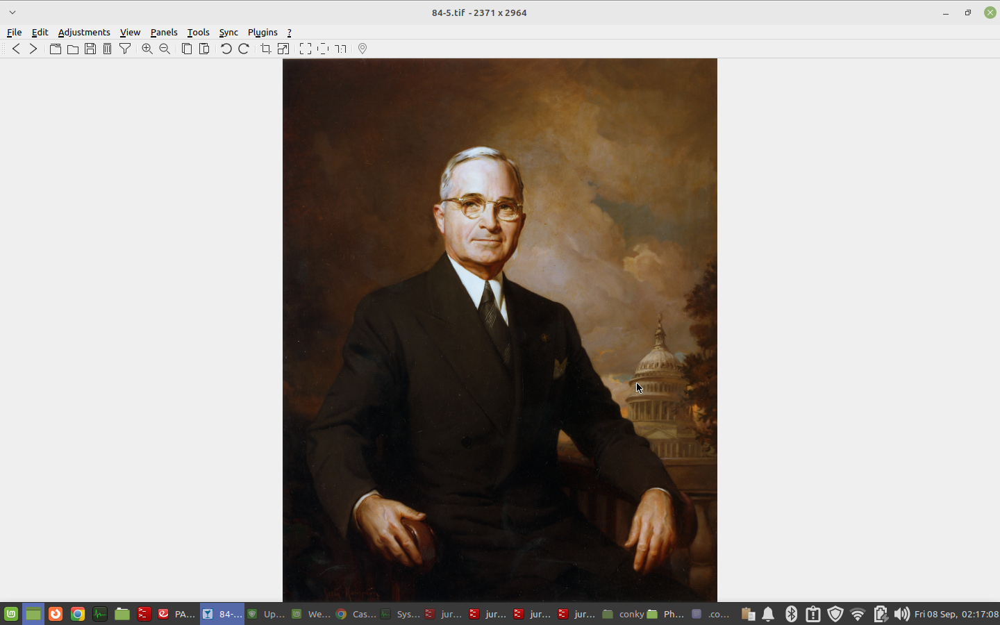
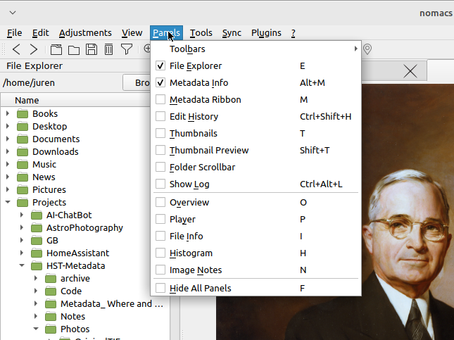
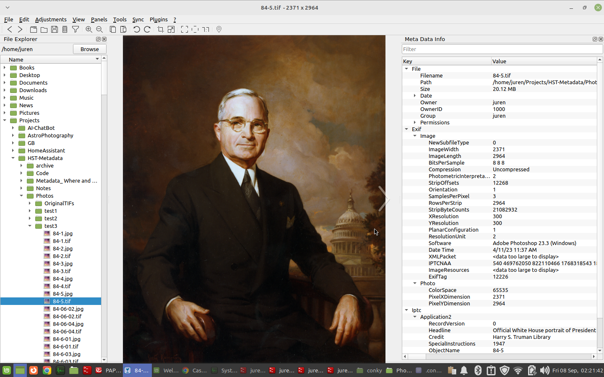

## Configuring nomacs for HSTL Metadata Post-processing Review

The following will describe how to configure the nomacs image viewer to enable the rapid review of HSTL images with metadata tags for post-processing review.

Below is the nomacs user interface “out-of-the-box” with just the image displayed in the middle of the screen.  [Click on the image to enlarge]

 

To begin configuring the  nomacs image viewer, select Panel from the top menu and click on the File Explorer and Metadata Info options in the pull down menu.   [Click on the image to enlarge]

 

This will create a three panel interface with the File Explorer on the left, the Image in the middle and the Metadata Info on the right as shown below.  [Click on the image to enlarge]

 
